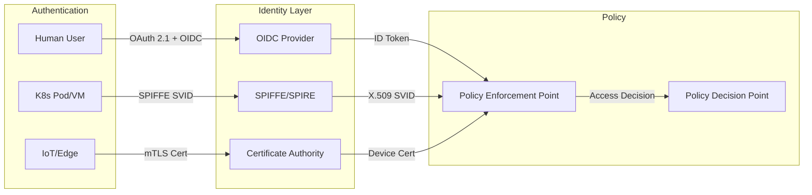
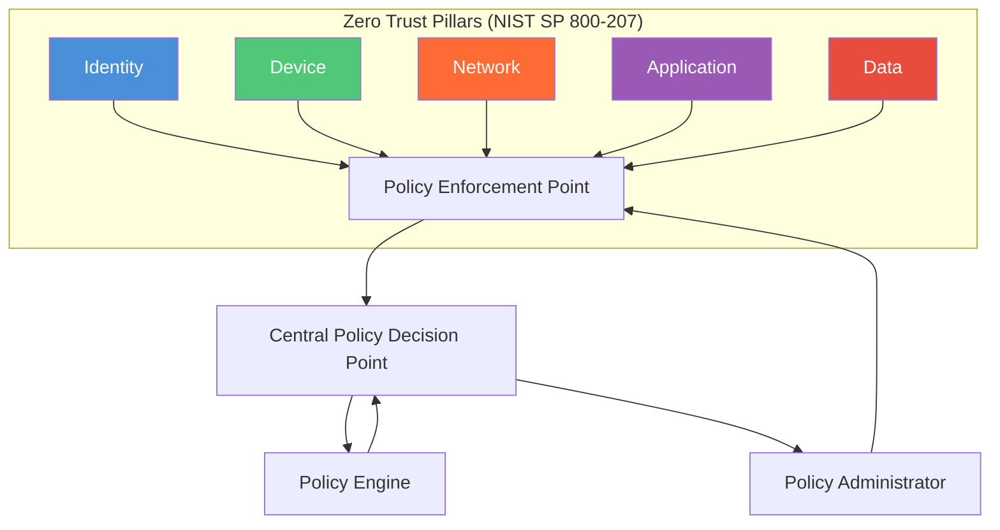
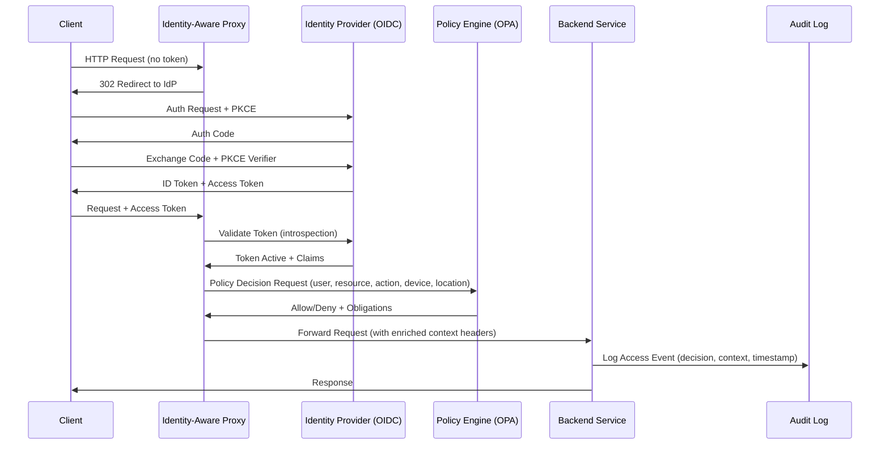
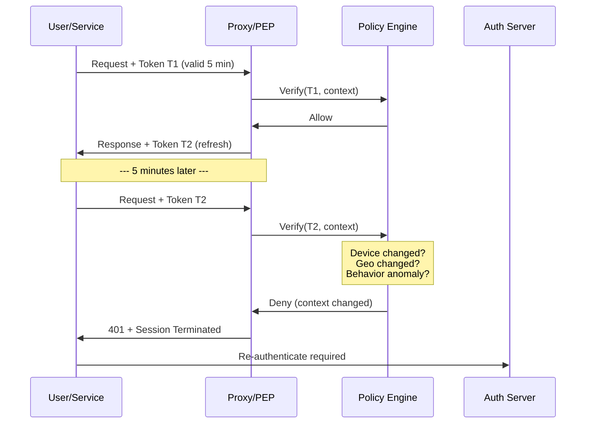
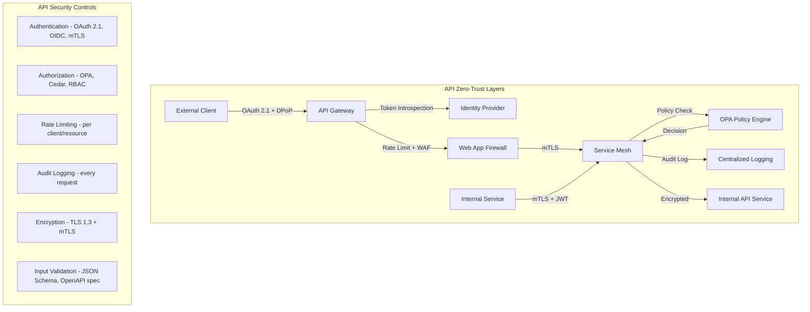

# Zero-Trust Architecture: Implementing Security in Distributed Cloud Systems

The perimeter-based security model that defined the early cloud era is obsolete. In the current 2026 landscape, organizations operate across hybrid environments where workloads span public clouds, private data centers, and edge nodes. The fundamental shift has moved from "trust but verify" to **"never trust, always verify."** This paradigm is not merely a buzzword; it is an architectural necessity driven by AI-driven threats, supply chain attacks, and the exponential growth of distributed microservices. For senior architects, implementing Zero-Trust Architecture (ZTA) is no longer optional—it is the baseline requirement for any resilient cloud-native system.

## The 2026 Security Landscape and the Shift to Zero Trust

The modern threat surface has expanded beyond network boundaries. With the rise of serverless computing and ephemeral containers, traditional firewall rules are insufficient. Attackers no longer need to breach a perimeter; they can pivot laterally through exposed APIs or compromised service accounts. The 2026 landscape demands that security be intrinsic to the application logic rather than an overlay.

Zero-Trust Architecture mandates that every access request is treated as if it originates from an open network. This requires three foundational shifts in design philosophy:

- **Explicit Verification:** Every user and device must be authenticated and authorized before accessing resources.
- **Least Privilege Access:** Permissions are granted dynamically based on context, not static roles.
- **Continuous Monitoring:** Security is not a one-time state but a continuous process of validation.

Legacy systems often rely on IP whitelisting, which fails in a distributed environment where services communicate over private subnets or public endpoints. The new standard requires identity-aware proxies that inspect every request header and payload to ensure the entity making the call is legitimate. This approach significantly reduces the blast radius of a breach, ensuring that even if credentials are stolen, they cannot be reused without additional verification factors like device posture or geo-location context.

## Zero Trust Core Principles: Never Trust, Always Verify

At the heart of ZTA lies the **"never trust, always verify"** mantra. This principle rejects the implicit trust model of traditional perimeter security and replaces it with a framework where trust is continuously evaluated. The core tenets are:

| Principle | Description | Traditional Equivalent |
|-----------|-------------|----------------------|
| **Never Trust, Always Verify** | Every request is fully authenticated, authorized, and encrypted before access is granted — regardless of network location. | Trusted internal networks |
| **Assume Breach** | Design systems assuming an attacker is already present. Segment access, encrypt everything, and log all activity. | Trust-but-verify |
| **Least Privilege Access** | Grant only the minimum permissions necessary for a user, device, or service to perform its function, enforced via Just-In-Time (JIT) access. | Broad role-based access |
| **Micro-Segmentation** | Break the network into the smallest possible isolation zones, restricting lateral movement even within trusted boundaries. | Coarse network segments |
| **Continuous Verification** | Re-evaluate trust continuously throughout a session — not just at authentication time. | Authentication only at login |

## The Five Pillars of Zero Trust

The National Institute of Standards and Technology (NIST) SP 800-207 defines five core pillars that form the foundation of any ZTA implementation:

### 1. Identity
Identity is the new perimeter. Every user, service, and device must have a strongly attested identity before accessing any resource. Modern implementations leverage **OAuth 2.1** and **OpenID Connect (OIDC)** for user identity, and **SPIFFE/SPIRE** for workload identity.



**SPIFFE (Secure Production Identity Framework for Everyone)** defines a standard for identity in dynamic environments. **SPIRE** is the production implementation that issues SPIFFE Verifiable Identity Documents (SVIDs) — either as X.509 certificates or JWT tokens — to workloads. Each workload receives a unique identity like `spiffe://cluster.local/ns/default/sa/frontend`, which is cryptographically verifiable without shared secrets.

```go
// Example: Go client that fetches a SPIFFE SVID for workload identity
package main

import (
    "context"
    "github.com/spiffe/go-spiffe/v2/providers/workload"
    "github.com/spiffe/go-spiffe/v2/spiffeid"
    "github.com/spiffe/go-spiffe/v2/svid/x509svid"
)

func main() {
    ctx := context.Background()
    // Connect to SPIRE agent via Workload API
    source, err := workload.NewX509Source(ctx, workload.WithClientOptions(
        workload.WithAddr("unix:///tmp/spire-agent/public/api.sock"),
    ))
    if err != nil {
        panic(err)
    }
    defer source.Close()

    // Fetch the SVID for the current workload
    svid, err := source.GetX509SVID()
    if err != nil {
        panic(err)
    }
    trustDomain := svid.ID.GetTrustDomain()
    workloadID := svid.ID.String()
    // Use svid.Certificates for mTLS connections
}
```

### 2. Devices
Device identity and posture assessment ensure that only trusted devices can access sensitive resources. Device trust signals include:
- **Hardware attestation** via TPM (Trusted Platform Module) or vTPM in cloud VMs.
- **OS patch level** and antivirus status reported to a device management system.
- **Compliance score** calculated by MDM/UEM platforms (e.g., Jamf, Intune, Fleet).

Policies can deny access if a device's compliance score falls below a threshold, or if it lacks the latest security patches — even if the user credentials are valid.

### 3. Network
The network pillar focuses on encrypting all traffic in transit and enforcing micro-segmentation. Unlike traditional network segmentation that relies on IP addresses and VLANs, micro-segmentation uses identity-based policies enforced at the workload level. Service meshes (Istio, Linkerd, Consul Connect) are the primary vehicles for implementing network-level zero trust in cloud-native environments.

### 4. Applications
Applications must be hardened to validate every request internally. This is achieved through:
- **API gateways** with built-in OAuth 2.0 token validation and rate limiting.
- **Sidecar proxies** (Envoy, linkerd-proxy) that enforce authorization policies transparently.
- **Runtime application self-protection (RASP)** that detects and blocks attacks in real-time.
- **Software supply chain security** — signed container images, SBOM validation, and admission controller policies.

### 5. Data
Data protection requires encryption at rest and in transit, combined with fine-grained access controls. Key practices include:
- **Encryption at rest** using envelope encryption with cloud KMS (AWS KMS, GCP Cloud KMS, Azure Key Vault).
- **Data classification** with automated labeling and tokenization of PII/PHI.
- **Data loss prevention (DLP)** policies that inspect egress traffic for sensitive content.
- **Attribute-based access control (ABAC)** on data objects (e.g., "only users in the finance group with device posture score > 0.8 can read salary records").



## Micro-Segmentation vs. Network Segmentation

Traditional network segmentation divides networks into VLANs or subnets based on IP ranges, relying on firewalls at the perimeter and between segments. This approach is effective in static data centers but breaks down in dynamic cloud environments where workloads are ephemeral and IP addresses change constantly.

**Micro-segmentation** is a more granular approach that uses identity — not network topology — to isolate workloads. Key differences:

| Aspect | Network Segmentation | Micro-Segmentation |
|--------|---------------------|-------------------|
| Boundary | VLANs, subnets, firewall zones | Per-workload identity labels |
| Policy Granularity | Coarse (allow/deny between subnets) | Fine-grained (allow/deny per service, method, path) |
| Dynamic Adaptation | Requires manual reconfiguration | Automatically adapts as workloads scale |
| Lateral Movement Prevention | Limited within a segment | Blocks lateral movement down to the process level |
| Cloud-Native Fit | Poor (IPs change constantly) | Excellent (identity never changes) |
| Operational Overhead | High (firewall rule management) | Moderate (policy-as-code) |

### Implementation Pattern: Micro-Segmentation with Kubernetes Network Policies + Service Mesh

```yaml
# Kubernetes NetworkPolicy example: Isolate a frontend namespace
apiVersion: networking.k8s.io/v1
kind: NetworkPolicy
metadata:
  name: frontend-isolation
  namespace: frontend
spec:
  podSelector:
    matchLabels:
      app: web
  policyTypes:
  - Ingress
  - Egress
  ingress:
  - from:
    - namespaceSelector:
        matchLabels:
          kubernetes.io/metadata.name: ingress-nginx
    ports:
    - port: 8080
      protocol: TCP
  egress:
  - to:
    - namespaceSelector:
        matchLabels:
          kubernetes.io/metadata.name: backend
    ports:
    - port: 3000
      protocol: TCP
```

While Kubernetes NetworkPolicy provides basic micro-segmentation, it is limited to L3/L4 and does not handle identity-aware policies. For true zero-trust micro-segmentation, a service mesh is required to enforce L7 policies based on workload identity.

## Identity-Centric Security: OAuth 2.1, OIDC, and SPIFFE/SPIRE

### OAuth 2.1 and OIDC

OAuth 2.1 consolidates and simplifies OAuth 2.0 best practices into a single specification. Key improvements include:
- **PKCE is mandatory** for all authorization code flows (previously only for public clients).
- **Refresh tokens must be sender-constrained** (using mTLS or DPoP).
- **Implicit grant is removed** — all SPAs must use the authorization code flow with PKCE.
- **Resource Owner Password Grant is removed**.

**OpenID Connect (OIDC)** adds an identity layer on top of OAuth 2.1, providing a standardized `id_token` (JWT) that contains claims about the authenticated user. The token flow in a zero-trust architecture:



### Workload Identity for Kubernetes

In Kubernetes, workloads need their own identities independent of human users. The standard approach combines **Service Accounts**, **Trusted Identities**, and **SPIFFE/SPIRE**:

```yaml
# Kubernetes Service Account with SPIFFE-compatible annotations
apiVersion: v1
kind: ServiceAccount
metadata:
  name: payments-service
  namespace: production
  annotations:
    spire.io/workload-identity: "true"
    spire.io/registration-entry: "payments"
---
# Pod that uses the service account and requests a SPIFFE identity
apiVersion: v1
kind: Pod
metadata:
  name: payments-service-v1
  namespace: production
  annotations:
    spire.io/identity: "spiffe://cluster.local/ns/production/sa/payments-service"
spec:
  serviceAccountName: payments-service
  containers:
  - name: app
    image: payments-service:2.4.1
    ports:
    - containerPort: 8080
  - name: spire-agent
    image: spire-agent:1.10.0
    volumeMounts:
    - name: spire-agent-socket
      mountPath: /spire-agent
      readOnly: true
```

### SPIFFE/SPIRE in Depth

SPIRE implements the SPIFFE specification through a two-component architecture:
- **SPIRE Server**: Acts as the Certificate Authority (CA), manages registration entries, and handles signing requests.
- **SPIRE Agent**: Runs on each node, attests the node's identity to the server, and exposes the Workload API to local workloads.

Workload attestation flow:
1. The workload connects to the SPIRE Agent via a Unix domain socket.
2. The agent attests the workload's identity using Kubernetes service account tokens, process credentials, or container metadata.
3. The agent requests an SVID from the SPIRE Server.
4. The server validates the registration entry and issues an X.509 or JWT SVID.
5. The workload uses the SVID for mTLS with other services.

## Service Mesh Zero Trust: Istio, Linkerd, and Consul Connect

Service meshes are the canonical implementation of zero trust for cloud-native applications. They provide a dedicated infrastructure layer for handling service-to-service communication with built-in mTLS, authorization, and observability.

### Comparison of Service Mesh Zero Trust Capabilities

| Feature | Istio | Linkerd | Consul Connect |
|---------|-------|---------|----------------|
| **mTLS** | Automatic with mutual mode | Automatic (default) | Automatic via sidecar |
| **Identity** | Kubernetes Service Account + SPIFFE | Kubernetes Service Account | Consul Service Identity |
| **Certificate Rotation** | 24h default (configurable) | 24h default | Configurable via Vault |
| **Authorization Policy** | L7 (HTTP method, path, headers, JWT claims) | L4 (TCP-level, service identity) | L7 (via Envoy or native proxy) |
| **Policy Engine Integration** | OPA (via envoy-ext-authz), native | Custom (linkerd-policy) | Consul Intention-based |
| **Mutual TLS Port** | 15443 (gateway) | 4143 (inbound) | 8502 (sidecar) |
| **Performance Overhead** | ~5-15% latency increase | ~1-5% latency increase | ~3-10% latency increase |
| **Mesh Expansion Beyond K8s** | Yes (VM mesh expansion) | Limited | Yes (Consul multi-platform) |
| **Observability** | Extensive (Kiali, Prometheus, Grafana) | Good (web dashboard, Prometheus) | Good (Consul UI, Prometheus) |

### Istio Authorization Policy Example

```yaml
# Istio AuthorizationPolicy: Fine-grained L7 access control
apiVersion: security.istio.io/v1beta1
kind: AuthorizationPolicy
metadata:
  name: payments-service-authz
  namespace: production
spec:
  selector:
    matchLabels:
      app: payments-service
  action: ALLOW
  rules:
  - from:
    - source:
        principals: ["cluster.local/ns/frontend/sa/checkout-service"]
        namespaces: ["frontend"]
    to:
    - operation:
        methods: ["POST", "GET"]
        paths: ["/api/v1/payments/*"]
        ports: ["8080"]
    when:
    - key: request.auth.claims[iss]
      values: ["https://accounts.myorg.com"]
    - key: source.ip
      values: ["10.0.0.0/8"]
  - from:
    - source:
        principals: ["cluster.local/ns/admin/sa/admin-panel"]
        namespaces: ["admin"]
    to:
    - operation:
        methods: ["GET"]
        paths: ["/api/v1/payments/audit/*"]
    when:
    - key: request.headers[X-Admin-Role]
      values: ["auditor", "compliance"]
```

This policy enforces:
- Only the `checkout-service` in the `frontend` namespace can `POST` and `GET` to payment endpoints.
- Only users authenticated via the corporate IdP (`iss` claim) are permitted.
- Only traffic from the internal IP range `10.0.0.0/8` is allowed.
- Admin-level access is restricted to GET on audit endpoints with a specific header.

### Linkerd Authorization Policy

Linkerd uses a simpler authorization model based on `ServerAuthorization` and `AuthorizationPolicy` resources:

```yaml
# Linkerd AuthorizationPolicy: Identity-based L4 access
apiVersion: policy.linkerd.io/v1beta1
kind: AuthorizationPolicy
metadata:
  name: payments-server-authz
  namespace: production
spec:
  targetRef:
    group: policy.linkerd.io
    kind: Server
    name: payments-server
  requiredAuthenticationReferences:
  - name: payments-authn
---
apiVersion: policy.linkerd.io/v1beta1
kind: MeshTLSAuthentication
metadata:
  name: payments-authn
  namespace: production
spec:
  identities:
  - "checkout-service.frontend.serviceaccount.identity.linkerd.cluster.local"
```

### Consul Connect Intentions

Consul uses a central intentions API for service authorization:

```hcl
# Consul service intention: Zero-trust authorization
kind = "service-intentions"
name = "payments-api"

sources = [
  {
    name        = "checkout-service"
    action      = "allow"
    type        = "consul"
    description = "Allow checkout service to call payments API"
    permissions = [
      {
        action = "allow"
        http {
          path_exact  = "/api/v1/payments/process"
          methods     = ["POST"]
        }
      },
      {
        action = "deny"
        http {
          path_prefix = "/api/v1/admin"
          methods     = ["*"]
        }
      }
    ]
  }
]
```

## Policy Engines: OPA and Cedar

Policy engines decouple authorization logic from application code, enabling centralized policy management across all layers of the stack.

### Open Policy Agent (OPA)

OPA is the de-facto standard for cloud-native policy enforcement. It uses **Rego**, a declarative policy language designed for expressing rules over hierarchical data.

```rego
# OPA/Rego: Zero-trust access control policy for a payment service
package zero_trust.payments

import future.keywords.if
import future.keywords.in

# Default deny - zero-trust principle
default allow = false

# Allow if all conditions are satisfied
allow if {
    valid_identity(input.user)
    valid_device(input.device)
    allowed_operation(input.resource, input.action)
    not suspicious_behavior(input)
}

# Validate user identity from OIDC claims
valid_identity(user) if {
    user.email != ""
    user.email_verified == true
    user.iss == "https://accounts.myorg.com"
    user.aud == "payments-api"
    token_not_expired(user.exp)
}

# Validate device posture
valid_device(device) if {
    device.compliance_score >= 0.8
    device.os_patches_current == true
    device.attestation_type == "TPM_2.0"
}

# Fine-grained resource authorization
allowed_operation(resource, action) if {
    some perm in data.policies.roles[input.user.role].permissions
    glob.match(perm.resource, ["/"], resource)
    perm.action == action
}

# Detect suspicious behavior patterns
suspicious_behavior(input) if {
    input.geo_velocity_kmh > 800  # Impossible travel
}

suspicious_behavior(input) if {
    input.failed_attempts_last_5min > 10
}

suspicious_behavior(input) if {
    input.device.os_version in data.policies.deprecated_os_versions
}

# Helper: Check token expiration
token_not_expired(exp) if {
    time.now_ns() / 1000000000 < exp
}
```

### Cedar Policy Language (AWS)

Cedar is Amazon's policy language, used in AWS Verified Permissions and Amazon Verified Access. It is simpler than Rego and optimized for coarse-to-fine-grained access control:

```cedar
// Cedar policy: Zero-trust API access
// Allow a finance user to read payment records during business hours
permit (
    principal in AWS::IAM::Role::"finance-analyst",
    action == PaymentService::Action::"ReadPayment",
    resource in PaymentService::Resource::"PaymentRecord"
) when {
    context.device.compliance_score >= 0.8
    && context.time_of_day >= "09:00"
    && context.time_of_day <= "17:00"
    && context.network.vpn == true
};

// Explicit deny for non-compliant devices - takes precedence over allows
forbid (
    principal,
    action,
    resource
) when {
    context.device.compliance_score < 0.5
};
```

### Policy Engine Comparison

| Aspect | OPA (Rego) | Cedar |
|--------|-----------|-------|
| **Policy Language** | Declarative, Datalog-inspired | Declarative, SQL-like syntax |
| **Use Case** | General-purpose (K8s, API gateways, CI/CD, Terraform) | AWS-native (Verified Permissions, Verified Access) |
| **Decision Caching** | Built-in with TTL | Via AWS side |
| **Partial Evaluation** | Yes | No |
| **Integration** | Sidecar, external (HTTP/gRPC), Go library | AWS SDK, REST API |
| **Multi-cloud** | Works anywhere | AWS-only for managed service |
| **Learning Curve** | Steep (Rego is unique) | Moderate (familiar syntax) |
| **Performance** | ~1-5ms per decision (warm) | ~5-15ms (AWS API call) |

## Continuous Verification and Monitoring

Zero trust requires continuous verification of every request throughout a session. This is fundamentally different from traditional models that authenticate once and trust for the session duration.

### Session Token Rotation Pattern

Short-lived tokens (5-15 minutes) force continuous re-authentication against the Policy Engine:



### Monitoring Stack for Zero Trust

| Component | Tooling | What It Monitors |
|-----------|---------|------------------|
| **Service Mesh Observability** | Kiali, Grafana, Prometheus | Traffic flow, mTLS status, request rates, error rates |
| **Auth Decision Logging** | OPA decision logs, SPIRE audit logs | Allow/deny decisions, policy evaluation traces |
| **SIEM Integration** | Splunk, Elastic Security, Wazuh, Sentinel | Correlated security events across the stack |
| **Behavioral Analytics** | Custom ML pipelines, Darktrace | Anomaly detection on access patterns |
| **Certificate Monitoring** | cert-manager, Vault, Prometheus Blackbox | Expiry dates, rotation failures, issuance rates |
| **Compliance Dashboard** | Custom (Grafana), AWS Security Hub, Azure Policy | Compliance posture against frameworks |

### Real-Time Anomaly Detection with Machine Learning

```python
# Simplified anomaly detection for zero-trust access patterns
import numpy as np
from sklearn.ensemble import IsolationForest

# Features extracted from access request context
# [hour_of_day, geo_velocity, resource_sensitivity, failed_attempts_last_5m, device_compliance_score]
normal_patterns = np.array([
    [10, 0, 2, 0, 0.95],  # Normal: business hours, same city, routine access
    [14, 5, 1, 0, 0.90],
    [11, 12, 3, 1, 0.88],
    [15, 3, 2, 0, 0.92],
])
anomalous_patterns = np.array([
    [3, 800, 5, 15, 0.3],  # Anomaly: 3am, impossible travel, high sensitivity, many failures, low compliance
    [2, 1200, 5, 25, 0.2],
    [23, 950, 4, 40, 0.1],
])

model = IsolationForest(contamination=0.1, random_state=42)
model.fit(normal_patterns)

def evaluate_access(access_context):
    features = np.array([[
        access_context['hour'],
        access_context['geo_velocity'],
        access_context['resource_sensitivity'],
        access_context['failed_attempts_last_5m'],
        access_context['device_compliance_score'],
    ]])
    score = model.decision_function(features)[0]
    is_anomaly = model.predict(features)[0] == -1
    return {
        'allow': not is_anomaly,
        'anomaly_score': float(score),
        'requires_step_up_auth': score < -0.1
    }

# Example evaluation
result = evaluate_access({
    'hour': 3, 'geo_velocity': 850, 'resource_sensitivity': 5,
    'failed_attempts_last_5m': 20, 'device_compliance_score': 0.2
})
# Result: {'allow': False, 'anomaly_score': -0.35, 'requires_step_up_auth': True}
```

## Zero Trust for APIs

APIs are the primary attack surface in distributed systems. Zero-trust API security applies the same principles to every API call — internal or external.

### API Security Architecture



### API Gateway Configuration (Kong with OPA)

```yaml
# Kong API Gateway plugin configuration for OPA authorization
plugins:
- name: opa
  config:
    # OPA endpoint for policy decisions
    opa_host: opa-service.production.svc.cluster.local
    opa_port: 8181
    opa_path: /v1/data/zero_trust/api/allow
    # Include context for the policy decision
    include_body: true
    include_consumer: true
    include_service: true
    include_route: true
    # Cache decisions for performance
    decision_cache_ttl: 30
    # What to pass to OPA
    request_body:
      - path
      - method
      - headers
      - query
    # Fail closed on policy engine error
    fail_on_error: true
    # Default deny if OPA is unreachable
    default_decision: false
```

## Zero Trust Data Plane

The data plane encompasses all the runtime components that enforce zero-trust policies on actual traffic. In a cloud-native architecture, the data plane consists of:

### Data Plane Components

| Layer | Component | Zero-Trust Function |
|-------|-----------|-------------------|
| **L4/L7 Proxy** | Envoy, NGINX, HAProxy | mTLS termination, request routing, policy enforcement |
| **Sidecar Proxy** | Envoy (Istio), linkerd-proxy (Linkerd) | Identity-based authorization, telemetry generation |
| **Gateway** | Istio Ingress Gateway, Kong, Gloo | External traffic authorization, token validation |
| **eBPF/CNI** | Cilium, Calico | Kernel-level network policy enforcement, identity-aware firewall |
| **Auth Sidecar** | OPA sidecar, SPIRE agent | Local decision caching, workload attestation |
| **API Gateway** | Kong, Apigee, AWS API Gateway | OAuth validation, rate limiting, threat detection |

### eBPF-Based Zero Trust with Cilium

Cilium leverages eBPF to enforce identity-based security policies directly in the Linux kernel, bypassing iptables and achieving sub-millisecond latency:

```yaml
# CiliumNetworkPolicy: Identity-aware zero-trust policy at L3/L4
apiVersion: "cilium.io/v2"
kind: CiliumNetworkPolicy
metadata:
  name: "payments-service-isolation"
  namespace: production
spec:
  endpointSelector:
    matchLabels:
      app: payments-service
  ingress:
  - fromEndpoints:
    - matchLabels:
        app: checkout-service
        io.kubernetes.pod.namespace: frontend
    toPorts:
    - ports:
      - port: "8080"
        protocol: TCP
  - fromEndpoints:
    - matchLabels:
        app: admin-service
        io.kubernetes.pod.namespace: admin
    toPorts:
    - ports:
      - port: "8443"
        protocol: TCP
  egress:
  - toEndpoints:
    - matchLabels:
        app: postgres
    toPorts:
    - ports:
      - port: "5432"
        protocol: TCP
```

## Compliance Mapping: Aligning Zero Trust with Regulatory Frameworks

Zero-trust controls map directly to compliance requirements across major frameworks:

| Compliance Framework | Zero-Trust Control | Implementation |
|---------------------|-------------------|----------------|
| **SOC 2** (CC6, CC7) | Logical access controls, monitoring | mTLS + OPA policies + SIEM logging |
| **PCI DSS v4.0** | Requirement 7 (Access Control), 8 (Authentication), 10 (Logging) | Short-lived tokens, MFA, audit trails |
| **HIPAA** | §164.312 (Access Control, Audit Controls, Integrity) | Encryption at rest + transit, access logging |
| **GDPR** | Art. 32 (Security of Processing), Art. 25 (Data Protection by Design) | Identity-based access, data classification, DLP |
| **FedRAMP** | AC-3 (Access Enforcement), IA-2 (Identification/Authentication) | IAM integration, MFA, continuous monitoring |
| **ISO 27001** | A.9 (Access Control), A.12 (Operations Security) | ABAC policies, change management, incident response |
| **NIST CSF** | PR.AC (Access Control), DE.CM (Continuous Monitoring) | ZTA maturity model alignment |

### Mapping Example: PCI DSS v4.0 to ZTA Controls

| PCI DSS v4.0 Requirement | Zero-Trust Implementation |
|--------------------------|--------------------------|
| 7.2.3 — Restrict access to cardholder data by business need-to-know | OPA policies evaluating JWT claims + device posture before granting access to payment records |
| 8.3.1 — MFA for all non-console access | OAuth 2.1 with OIDC enforcing MFA step-up auth for sensitive actions |
| 8.3.4 — Inactivity timeout / re-authentication | Short-lived tokens (5 min TTL) with continuous verification |
| 10.2.1 — Audit trails for all access to cardholder data | Structured audit logging with every policy decision recorded to SIEM |
| 10.7.1 — Retain audit logs for at least 12 months | Centralized log retention with read-only access, immutability via object locks |
| 4.2.1 — Encrypt cardholder data over open/public networks | mTLS for all service-to-service communication (Istio, Linkerd) |

## Real-World Case Studies

### Case Study 1: FinTech Company Migrates to Zero Trust (Monzo-like)

**Challenge:** A digital bank with 500+ microservices needed to meet PCI DSS compliance while enabling developers to deploy 50+ times daily. Perimeter security was impossible with dynamic IPs and cloud-native architecture.

**Solution:**
- Deployed **Istio service mesh** across 12 Kubernetes clusters with automatic mTLS.
- Implemented **SPIRE** for workload identity — each service got a SPIFFE ID.
- Wrote **OPA policies** in Rego to enforce PCI DSS access controls.
- Deployed **short-lived JWT tokens** (2-minute TTL) for session management.

**Results:**
- 100% mTLS coverage across all service-to-service calls within 4 months.
- Reduced blast radius: a compromised pod could not access any other namespace.
- PCI DSS audit passed with zero findings in the access control domain.
- Developer velocity remained unchanged: security was transparent via the mesh.

### Case Study 2: Healthcare Provider Secures Hybrid Cloud

**Challenge:** A hospital network running legacy on-premise systems alongside new cloud-native applications needed HIPAA compliance. Patient data flowed between systems with inconsistent security controls.

**Solution:**
- Deployed **Consul Connect** with native sidecar proxies for hybrid mesh (on-prem + cloud).
- Used **Vault** for certificate management and dynamic database credentials.
- Implemented **device posture checks** via MDM integration for clinical workstations.
- Deployed **Cilium** with eBPF-based network policies for kernel-level enforcement.

**Results:**
- Achieved HIPAA compliance for the entire hybrid infrastructure.
- Reduced lateral movement risk by 90% via micro-segmentation.
- Certificate rotation automated end-to-end, eliminating manual key management.
- Patient data breaches dropped to zero in the 18 months post-migration.

### Case Study 3: E-Commerce Platform API Security

**Challenge:** A large e-commerce platform with 2,000+ API endpoints suffered from credential stuffing attacks and privilege escalation via compromised service accounts.

**Solution:**
- Implemented **OAuth 2.1 with DPoP** (Demonstration of Proof-of-Possession) binding tokens to client TLS keys.
- Deployed **Kong API Gateway** with **OPA plugin** for per-endpoint authorization.
- Integrated **behavioral analytics** — ML models detected compromised service accounts within minutes.
- Used **Linkerd** for service-to-service mTLS with automatic identity.

**Results:**
- Credential stuffing attacks blocked at the gateway (99.9% reduction in false positives).
- Compromised service account detection in under 3 minutes (vs. 24 hours previously).
- API abuse (scraping, unauthorized data access) decreased by 85%.

## Migration Strategy: Perimeter-Based to Zero Trust (Detailed)

### Phase 1: Discovery and Classification (Weeks 1-4)
- **Asset Inventory:** Catalog every service, API, data store, and user role using automated discovery tools (e.g., Cartography, AWS Config, GCP Asset Inventory).
- **Data Classification:** Tag resources by sensitivity (public, internal, confidential, restricted). Use automated data scanners for PII/PHI detection.
- **Trust Mapping:** Document all implicit trust relationships — which services can talk to which databases, which users have VPN access, which firewall rules exist.
- **Gap Analysis:** Identify which communications are currently unencrypted, which use static credentials, and which lack audit logging.

### Phase 2: Identity Foundation (Weeks 5-8)
- **Federated IAM:** Deploy an Identity Provider (Keycloak, Okta, Azure AD) with OIDC support. Configure federation between existing identity stores (LDAP, Active Directory).
- **Workload Identity:** Install SPIRE or cert-manager for workload identity. Configure registration entries for every service.
- **Service Mesh Pilot:** Deploy Istio or Linkerd in a single non-critical namespace. Validate mTLS enforcement and performance impact. Run in permissive mode initially.

### Phase 3: Policy as Code (Weeks 9-14)
- **Policy Development:** Write OPA policies covering the most critical access paths. Start with read-only operations and minimal privilege policies.
- **Audit Mode:** Deploy policies in audit mode — log all violations without blocking. Analyze patterns to refine rules.
- **CI/CD Integration:** Add OPA policy checks to CI/CD pipelines using `opa test` and `conftest`. Block deployments that violate security policies.

```yaml
# CI/CD pipeline: Validate Kubernetes manifests against OPA policies
# GitHub Actions workflow step
- name: Check Kubernetes security policies
  uses: open-policy-agent/conftest-action@v2
  with:
    files: k8s/manifests/*.yaml
    policy: policies/kubernetes/
    namespace: zero_trust.kubernetes
    all_namespaces: false
    no_fail: false
```

### Phase 4: Enforce and Extend (Weeks 15-24)
- **Enforcement Graduation:** Move from audit-only to enforcement mode for each namespace. Start with non-critical namespaces, then extend to production.
- **API Gateway Integration:** Deploy identity-aware API gateways with OPA plugin for all external-facing APIs.
- **Network Policy Hardening:** Replace IP-based firewall rules with identity-based network policies (Cilium, Calico, or mesh-native).
- **Certificate Lifecycle Automation:** Configure automated renewal with 24-hour certificate rotation. Deploy cert-manager with ClusterIssuers.

### Phase 5: Continuous Optimization (Ongoing)
- **Anomaly Detection:** Deploy ML-based behavioral analytics on top of audit log streams. Create automated response playbooks for high-confidence anomalies.
- **Policy Refinement:** Regularly review OPA decision logs to identify over-permissive rules. Tighten policies iteratively.
- **Penetration Testing:** Conduct quarterly zero-trust bypass testing. Validate that compromised credentials cannot lead to lateral movement.
- **Compliance Audits:** Map ZTA controls to regulatory frameworks. Generate compliance reports automatically from audit logs.

## Conclusion

Zero-Trust Architecture is not a product you buy or a configuration you toggle — it is a fundamental shift in how we think about security in distributed systems. In the 2026 threat landscape, where AI-driven attacks and supply chain compromises are the norm, the perimeter-based model is not just inadequate; it is dangerous.

By implementing explicit verification for every request, enforcing least privilege through dynamic policies, and maintaining continuous monitoring across all layers of the stack, organizations can build systems that are resilient by design. The migration is neither quick nor trivial, but the cost of inaction — a single breach propagating laterally through unsecured internal networks — far exceeds the investment required.

The five pillars (Identity, Devices, Network, Applications, Data) provide a comprehensive framework for thinking about zero trust holistically. Service meshes (Istio, Linkerd, Consul Connect) and policy engines (OPA, Cedar) provide the implementation tools. Compliance frameworks (PCI DSS, HIPAA, SOC 2, FedRAMP) validate the approach. Real-world case studies from fintech, healthcare, and e-commerce prove it works at scale.

Start today with the discovery phase. Map your implicit trust relationships, deploy your identity layer, and begin the journey toward a zero-trust future. Your organization's security depends on it.
